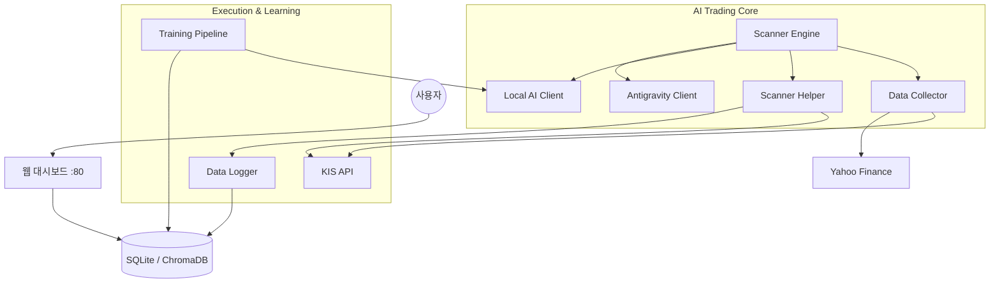

# KIS-Stock-AI 종합 매뉴얼

한국투자증권 Open API + 하이브리드 AI 기반 **글로벌 자동 주식 매매 시스템**

---

## 1. 시스템 소개

### 1.1 개요
**KIS-Stock-AI**는 한국(KR), 미국(US), 일본(JP), 중국(CN), 홍콩(HK) 등 5개국 주식 시장을 24시간 모니터링하고, AI 분석을 통해 자동으로 매매를 수행하는 시스템입니다. 단순한 기술적 지표 매매를 넘어, 로컬 AI와 클라우드 AI를 결합한 하이브리드 분석과 자가 학습(Self-Learning) 기능을 갖추고 있습니다.

### 1.2 핵심 특징
*   **🌍 글로벌 커버리지:** 5개국 시장의 시세 수집, 환율 계산, 주문 실행을 통합 지원합니다.
*   **🧠 하이브리드 AI:** 빠르고 비용 효율적인 **로컬 AI(Ollama/Qwen)**가 1차 분석을, 고성능 **Cloud AI(Gemini)**가 2차 검증 및 심층 분석을 담당합니다.
*   **📰 뉴스 기반 판단:** 차트 데이터뿐만 아니라 실시간 뉴스를 수집하여 시장 심리(Sentiment)를 매매 판단에 반영합니다.
*   **🛡️ 강력한 리스크 관리:** Trailing Stop, Hard Stop-Loss, 포트폴리오 리밸런싱 등 다층적인 자산 보호 로직이 적용되어 있습니다.
*   **📈 자가 발전형:** 매매 기록을 데이터셋으로 축적하고, 이를 바탕으로 로컬 모델을 미세조정(Fine-tuning)하여 성능을 지속적으로 개선합니다.

---

## 2. 시스템 아키텍처

### 2.1 전체 구조


### 2.2 AI 모델 역할 분담
| 역할 | 모델 | 용도 | 장점 |
|---|---|---|---|
| **1차 분석** | 로컬 AI (Qwen 2.5 7B) | 차트 패턴, 지표 분석 | 속도 빠름, 비용 무료, 데이터 보안 |
| **2차 분석** | Antigravity (Gemini) | 복합 추론, 뉴스 분석, Fallback | 높은 지능, 최신 정보 처리 능력 |
| **학습** | Unsloth (QLoRA) | 로컬 모델 미세조정 | 나만의 매매 스타일 학습 가능 |

---

## 3. 주요 기능 및 매매 규칙

### 3.1 종목 선정 (Targeting)
1.  **고정 리스트:** `Watchlist` DB에 등록된 우량주.
2.  **동적 랭킹:** KIS/Yahoo 실시간 등락률/거래량 상위 종목 자동 포착.
3.  **저가주 발굴:** 예수금이 적을 경우, 가격대에 맞는 저평가 종목 검색.

### 3.2 리스크 관리 (Risk Management)
*   **Hard Stop-Loss:** 수익률 **-5.0%** 도달 시 AI 판단 없이 즉시 시장가 손절.
*   **Trailing Stop:** 수익률 **+3.0%** 도달 시 활성화, 이후 최고점 대비 **-1.5%** 하락 시 익절.
*   **Time Based ROI:** 보유 시간이 길어질수록 목표 수익률을 낮춰(예: 4시간 후 +0.5%) 자금 회전율을 높임.
*   **Portfolio Rebalancing:** 스윙 vs 단타 비중이 깨지면(예: 스윙 과다), AI에게 매도 기준을 완화하여 현금화를 유도.

### 3.3 주문 실행 (Execution)
*   **Lot Size 자동 보정:** 일본/중국/홍콩 시장의 최소 주문 단위(100주 등)를 자동으로 계산하여 주문.
*   **통합증거금:** 환전 없이도 통합증거금을 활용하여 해외 주식 주문 가능 금액을 정확히 산출.

### 3.4 Off-Market 활동 (장 마감 후)
장이 닫힌 시간에도 시스템은 멈추지 않습니다.
1.  **데이터 수집:** 6개월치 일봉 데이터 사전 수집.
2.  **뉴스 분석:** 주요 종목 뉴스 수집 및 감성 분석.
3.  **글로벌 분석:** 미국 시장 마감 후 아시아 시장 영향력 예측.
4.  **프리마켓 선별:** 다음 장 시초가 공략 후보군 선별.

### 3.5 자가 학습 (Self-Learning)
*   **데이터 축적:** 매매 종료 시 진입 근거(Input)와 결과(Label)를 `TrainingDataset`에 저장.
*   **주말 자동 학습:** 매주 토요일 오전 9시, 축적된 데이터를 바탕으로 로컬 모델 재학습 및 교체.

---

## 4. 설치 및 실행 가이드

### 4.1 필수 조건
*   Python 3.10 이상
*   한국투자증권 Open API 계정 (App Key, Secret Key)
*   (선택) Google 계정 (Antigravity AI 사용 시)
*   (선택) NVIDIA GPU (로컬 학습 시 권장)

### 4.2 설치
```bash
# 1. 저장소 클론
git clone https://github.com/shartith/KIS-Stock-AI.git
cd KIS-Stock-AI

# 2. 가상환경 생성 및 패키지 설치
python -m venv venv
source venv/bin/activate  # Windows: venv\Scripts\activate
pip install -r requirements.txt
```

### 4.3 설정
`.env` 파일을 생성하고 키를 입력합니다. (웹 대시보드에서도 설정 가능)
```bash
cp .env.example .env
vi .env
```

### 4.4 실행
**로컬 실행 (추천):**
```bash
cd src/web
python app.py
```
웹 브라우저에서 `http://localhost:8080` 접속.

---

## 5. 운영 가이드 (Web Dashboard)

### 5.1 대시보드 (`/`)
*   국가별(KR, US, JP, CN, HK) 시장 현황 히트맵 확인.
*   AI의 실시간 로그 및 분석 과정(Reasoning) 모니터링.

### 5.2 트레이딩 (`/trading`)
*   TradingView 차트를 통한 상세 종목 분석.
*   수동 주문 실행 (AI 간섭 없이 매수/매도).

### 5.3 포트폴리오 (`/portfolio`)
*   현재 보유 종목의 실시간 수익률 및 평가액 확인.
*   국내/해외 통합 자산 현황 조회.

### 5.4 설정 (`/settings`)
*   **API 키 관리:** KIS, Google AI 키 입력 및 수정.
*   **AI 제어:** 로컬 모델 학습 시작, 데이터셋 내보내기/가져오기.
*   **알림 설정:** Discord Webhook URL 및 알림 조건 설정.

---

## 6. 문제 해결 (Troubleshooting)

*   **Q: 로컬 AI 연결이 안 됩니다.**
    *   A: Ollama가 실행 중인지 확인하세요 (`ollama serve`). 설정 페이지에서 URL이 올바른지 확인하세요.
*   **Q: 매수가 안 됩니다.**
    *   A: `Settings` > `거래 설정`에서 "자동 매수 실행"이 켜져 있는지, "장외 분석 활동" 시간은 아닌지 확인하세요. 예수금이 부족할 수도 있습니다.
*   **Q: 환율 정보가 이상합니다.**
    *   A: Yahoo Finance 연결 문제일 수 있습니다. 설정된 기본값(Fallback)이 사용됩니다. 잠시 후 다시 시도됩니다.

---
**Disclaimer:** 본 소프트웨어는 투자를 보조하는 도구이며, 실제 투자에 대한 책임은 사용자 본인에게 있습니다. 실전 투자 전 충분한 모의 투자 테스트를 권장합니다.
