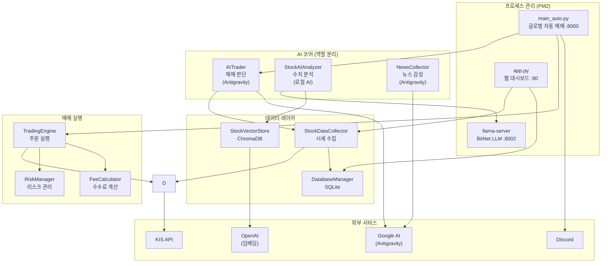
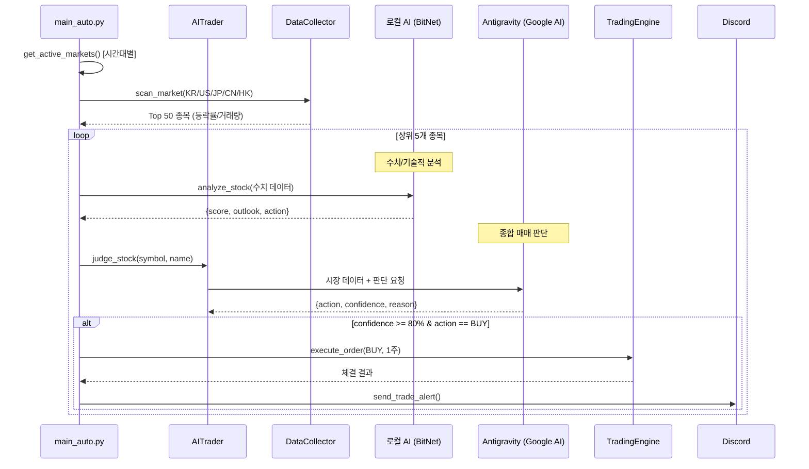
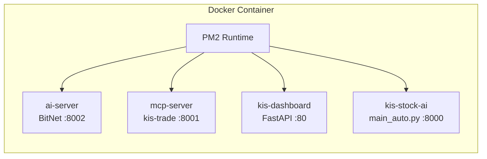

# KIS-Stock-AI 아키텍처 문서

한국투자증권 Open API + AI 기반 **글로벌 자동 주식 매매 시스템**

---

## 1. 프로젝트 개요

| 항목 | 내용 |
|---|---|
| **목적** | AI가 5개국 주식 시장을 24시간 모니터링하고 자동 매매 |
| **대상 시장** | 🇰🇷 한국, 🇺🇸 미국, 🇯🇵 일본, 🇨🇳 중국, 🇭🇰 홍콩 |
| **AI 모델** | 로컬 AI (BitNet 3B) + Antigravity (Google AI) |
| **API 연동** | KIS Open API 직접 호출 (`kis_api.py`) |
| **알림** | Discord Webhook |
| **프로세스 관리** | PM2 |
| **웹 대시보드** | FastAPI + Jinja2 + TradingView Charts |

---

## 2. 시스템 아키텍처



---

## 3. AI 모델 역할 분리

```
┌─────────────────────────────────────────────────────────┐
│                    AI 역할 분리 구조                      │
├─────────────────────┬───────────────────────────────────┤
│ 로컬 AI (BitNet 3B) │ Antigravity (Google AI)            │
│ :8002               │ API 직접 / OpenClaw Gateway        │
├─────────────────────┼───────────────────────────────────┤
│ ✅ 수치/기술적 분석   │ ✅ 매매 판단 (BUY/SELL/HOLD)       │
│   - OHLCV 패턴      │ ✅ 뉴스 감성 분석                   │
│   - 기술 지표        │ ✅ 시장 종합 리포트                  │
│   - 거래량 분석      │ ✅ 전략 추출/학습                   │
│   - 종목 순위        │ ✅ 이상 변동 분석                   │
├─────────────────────┼───────────────────────────────────┤
│ ai_analyzer.py      │ antigravity_client.py              │
│ local_llm.py        │ ai_trader.py                      │
│                     │ news_collector.py                  │
└─────────────────────┴───────────────────────────────────┘

인증 우선순위:
1. ANTIGRAVITY_API_KEY → Google AI 직접 호출
2. OpenClaw Gateway → localhost:18789 (fallback)
3. 로컬 LLM 실패 시 → Antigravity fallback
```

---

## 4. 디렉토리 구조

```
KIS-Stock-AI/
├── src/
│   ├── ai/                         # AI 트레이딩 시스템 (20개 모듈)
│   │   ├── main.py                 # CLI 수동 모드 (collect/analyze/report/monitor)
│   │   ├── main_auto.py            # 글로벌 자동 매매 메인 루프
│   │   ├── config.py               # 설정 (종목, AI 모드, 경로, API 키)
│   │   ├── data_collector.py       # MCP 기반 글로벌 시세 수집
│   │   ├── trading_system.py       # 통합 자동 투자 시스템
│   │   ├── trading_engine.py       # 국내/해외 주문 실행
│   │   ├── monitor_service.py      # 실시간 모니터링 & 이상 감지
│   │   ├── ai_trader.py            # AI 매매 판단 (Antigravity)
│   │   ├── ai_analyzer.py          # 수치/기술적 분석 (로컬 AI 전용)
│   │   ├── antigravity_client.py   # Google AI 클라이언트 (NLP 작업)
│   │   ├── local_llm.py            # 로컬 LLM 클라이언트 (BitNet/Ollama)
│   │   ├── vector_store.py         # ChromaDB 벡터 저장소
│   │   ├── database.py             # SQLite DB 관리 (SQLAlchemy)
│   │   ├── stock_screener.py       # 종목 스크리닝 (거래량/모멘텀/저평가)
│   │   ├── risk_manager.py         # 리스크 관리 & 포지션 사이징
│   │   ├── fee_calculator.py       # 매매 수수료 계산
│   │   ├── news_collector.py       # 뉴스 수집 & 감성 분석 (Antigravity)
│   │   ├── notification.py         # Discord Webhook 알림
│   │   └── test_collector.py       # 수집기 테스트
│   │
│   ├── web/                        # 웹 대시보드 (FastAPI)
│   │   ├── app.py                  # FastAPI 서버
│   │   ├── templates/              # Jinja2 HTML 템플릿 (6개 페이지)
│   │   └── static/                 # CSS/JS 정적 파일
│   │
│   └── api/examples_llm/           # KIS 공식 LLM 예제 코드
│
├── data/
│   ├── kis_stock.db                # SQLite (시세 OHLCV, 매매 기록, AI 분석)
│   ├── chroma_db/                  # ChromaDB (벡터 DB, 패턴/뉴스)
│   └── stocks_info/                # 종목 정보 데이터 (32개 파일)
│
├── scripts/
│   ├── start_all.sh                # 전체 시작 (PM2)
│   ├── stop_all.sh                 # 전체 중지
│   ├── collect.sh                  # 데이터 수집
│   └── report.sh                   # 리포트 생성
│
├── docs/
│   ├── architecture.md             # 아키텍처 문서 (이 파일)
│   ├── convention.md               # 코딩 컨벤션
│   ├── trading_rules.md            # 매매 규칙 (Lot Size, 시간 필터)
│   ├── currency_display.md         # 통화 표시 시스템
│   ├── offmarket_system.md         # Off-Market 활동 시스템
│   └── README.md                   # 프로젝트 소개
│

├── Dockerfile                      # All-in-One 도커 이미지
├── docker-compose.yml              # Docker Compose 실행
├── docker-entrypoint.sh            # 도커 진입점 (PM2 ecosystem)
├── requirements.txt                # Python 의존성
├── kis_devlp.yaml                  # KIS API 설정
├── .env                            # 환경변수 (API 키)
└── .env.example                    # 환경변수 템플릿
```

---

## 5. 핵심 모듈 상세

### 5.1 실행 모드

| 파일 | 모드 | 설명 |
|---|---|---|
| main.py | 수동 CLI | `--mode collect/analyze/opportunities/report/monitor` |
| main_auto.py | 글로벌 자동 | 5개국 시장 스캔 → AI 분석 → 자동 매매 (1분 루프) |
| trading_system.py | 통합 자동 | 스크리닝 → 분석 → 리스크 평가 → 체결 → 학습 |

### 5.2 AI 분석 체인



### 5.3 데이터 흐름

| 계층 | 모듈 | 역할 |
|---|---|---|
| **수집** | data_collector.py | KIS REST API 직접 호출 (`kis_api.py`), 현재가/지표/랭킹/잔고 |
| **저장** | database.py | SQLite에 OHLCV, 매매 기록, AI 분석 로그 |
| **벡터화** | vector_store.py | ChromaDB에 종목 패턴 벡터화 → 유사 패턴 검색 (RAG) |
| **뉴스** | news_collector.py | 웹 검색 → Antigravity 감성 분석 → 이상 변동 탐지 |

### 5.4 리스크 관리

risk_manager.py의 PortfolioConfig:

| 파라미터 | 값 | 설명 |
|---|---|---|
| `max_single_stock_ratio` | 20% | 단일 종목 최대 비중 |
| `max_sector_ratio` | 40% | 섹터별 최대 비중 |
| `min_cash_ratio` | 10% | 최소 현금 비율 |
| `max_loss_per_trade` | 2% | 건당 최대 손실 |
| `stop_loss_pct` | 5% | 손절 기준 |
| `take_profit_pct` | 10% | 익절 기준 |

---

## 6. 웹 대시보드

app.py — FastAPI, Port **80**

### 페이지 라우트

| URL | 템플릿 | 기능 |
|---|---|---|
| `/` | dashboard.html | 메인 대시보드 (시장 지수/히트맵) |
| `/trading` | trading.html | TradingView 차트 + 주문 |
| `/portfolio` | portfolio.html | 보유 종목 & 손익 |
| `/strategy` | strategy.html | AI 판단 로그 |
| `/settings` | settings.html | API 키/알림 설정 |

### API 엔드포인트

| Method | URL | 설명 |
|---|---|---|
| GET | `/api/stocks/{code}/chart` | 캔들 데이터 (TradingView용) |
| GET | `/api/market/indices` | 주요 지수 (KOSPI/KOSDAQ/S&P500) |
| GET | `/api/stocks/top` | 거래대금 상위 종목 |
| GET | `/api/scanner/state` | 스캐너 현재 상태 |
| GET | `/api/scanner/results` | 분석 완료 종목 결과 |
| GET | `/api/scanner/candidates` | 매수 후보 목록 |
| GET | `/api/offmarket/status` | Off-Market 활동 상태 |

---

## 7. 인프라 & 배포

### Docker (All-in-One)



### 포트 구성

| 포트 | 서비스 |
|---|---|
| **80** | 웹 대시보드 (FastAPI) |
| **8000** | 실제 프로그램 (main_auto.py) |
| **8001** | MCP 서버 (kis-trade) |
| **8002** | Local AI (llama-server / BitNet) |

### 환경변수

| 변수 | 용도 |
|---|---|
| `KIS_APP_KEY` | 한국투자증권 API |
| `KIS_SECRET_KEY` | 한국투자증권 Secret |
| `ANTIGRAVITY_API_KEY` | Google AI (뉴스/감성/매매 판단) |
| `ANTIGRAVITY_MODEL` | 모델명 (기본: `gemini-2.0-flash`) |
| `OPENAI_API_KEY` | OpenAI API (임베딩) |
| `DISCORD_WEBHOOK_URL` | Discord 알림 |
| `AI_MODE` | `local` (기본) |
| `LOCAL_LLM_URL` | 로컬 LLM 주소 (기본 `localhost:8002`) |

### 의존성

```
chromadb>=0.4.0, openai>=1.0.0, google-generativeai>=0.8.0
pandas>=2.0.0, numpy>=1.24.0, python-dotenv>=1.0.0
requests>=2.31.0, schedule>=1.2.0, sqlalchemy
+ fastapi, uvicorn, jinja2 (웹)
```

---

## 8. 마켓 스케줄러 (KST 기준)

| 시간 | 시장 |
|---|---|
| 09:00 ~ 15:00 | 🇯🇵 일본 |
| 09:00 ~ 15:30 | 🇰🇷 한국 |
| 10:00 ~ 16:00 | 🇨🇳 중국 |
| 10:00 ~ 17:00 | 🇭🇰 홍콩 |
| 23:30 ~ 06:00 | 🇺🇸 미국 |

주말(토/일)은 자동 휴장 처리

---

## 9. 실행 방법

```bash
# 1. 수동 모드 (CLI)
source venv/bin/activate
cd src/ai
python main.py --mode collect              # 시세 수집
python main.py --mode analyze --symbol 005930  # 종목 분석
python main.py --mode report               # 일일 리포트

# 2. 글로벌 자동 매매
python main_auto.py --live    # 실전 투자
python main_auto.py           # 모의 투자 (dry-run)

# 3. PM2 전체 실행 (로컬)
./scripts/start_all.sh
./scripts/stop_all.sh

# 4. Docker (권장)
docker compose up -d
docker compose logs -f
docker compose down

# → 웹 대시보드: http://localhost
```

---

## 10. 현재 구현 상태

| 기능 | 상태 |
|---|---|
| 국내 주식 데이터 수집 (KIS MCP) | ✅ 완료 |
| 해외 주식 데이터 수집 (5개국) | ✅ 완료 |
| AI 수치 분석 (로컬 LLM) | ✅ 완료 |
| AI 종합 분석 (Antigravity) | ✅ 완료 |
| 자동 매매 엔진 (국내/해외) | ✅ 완료 |
| 글로벌 마켓 스케줄러 | ✅ 완료 |
| 동적 타겟팅 (Top 50) | ✅ 완료 |
| Discord 알림 | ✅ 완료 |
| ChromaDB 벡터 저장 | ✅ 완료 |
| SQLite DB (OHLCV/매매/분석) | ✅ 완료 |
| 리스크 관리 (손절/익절/포지션) | ✅ 완료 |
| 웹 대시보드 (5페이지) | ✅ 완료 |
| PM2 프로세스 관리 | ✅ 완료 |
| Docker All-in-One | ✅ 완료 |
| 뉴스 감성 분석 (Antigravity) | ✅ 완료 (검색 API 미연동) |
| 전략 학습 (Antigravity) | ✅ 완료 (검색 API 미연동) |
| 거래소별 Lot Size 자동 조정 | ✅ 완료 |
| 네이티브 통화 표시 (5개국) | ✅ 완료 |
| 장 마감 종목 자동 제거 | ✅ 완료 |
| Off-Market 활동 시스템 (6기능) | ✅ 완료 |
| 백테스팅 | ❌ 미구현 |
| 일일 성과 리포트 자동화 | ❌ 미구현 |
